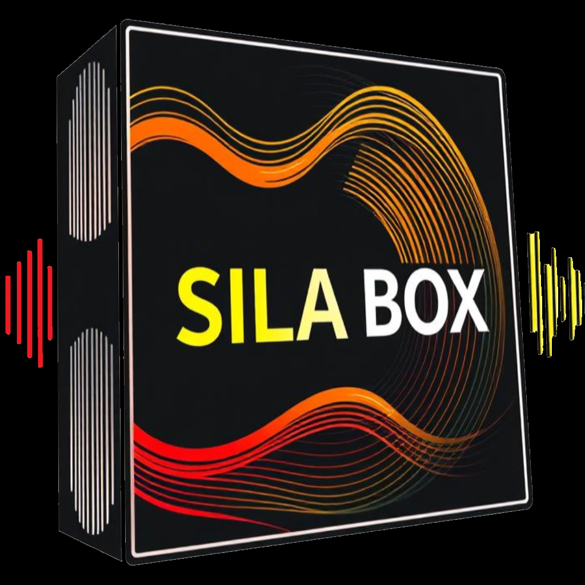
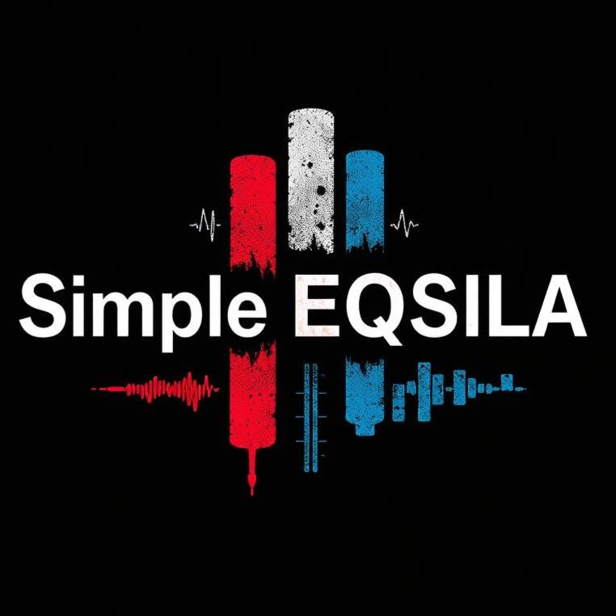
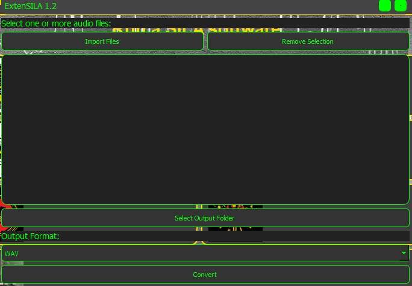
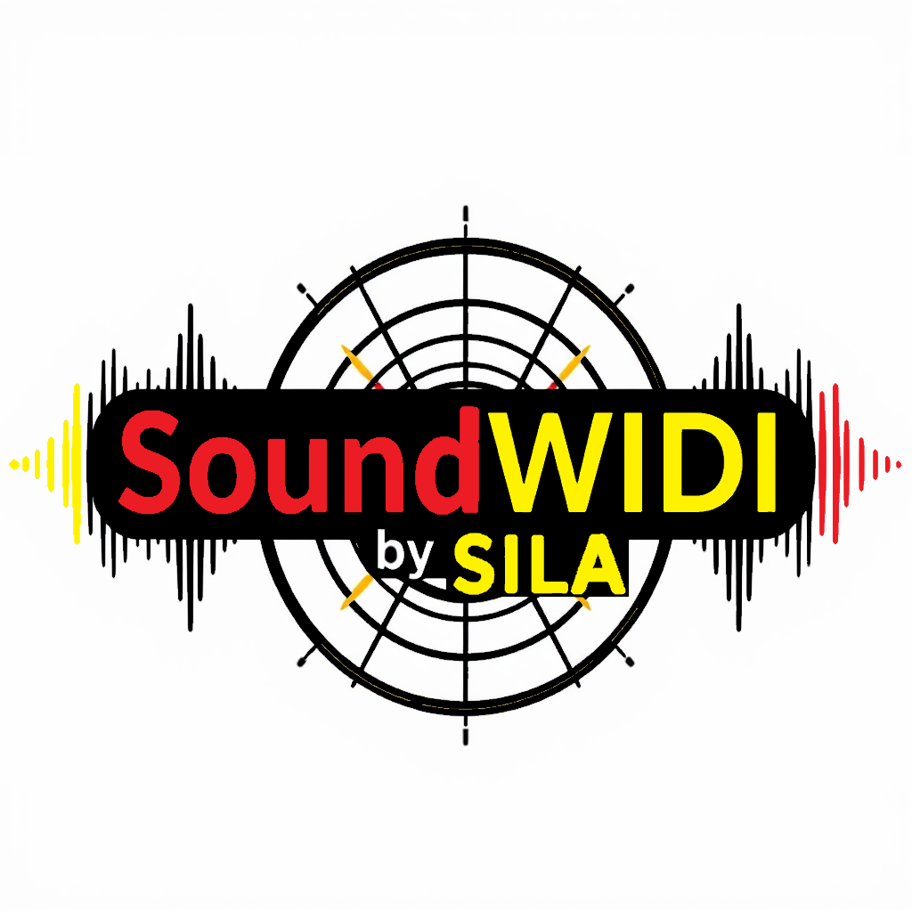
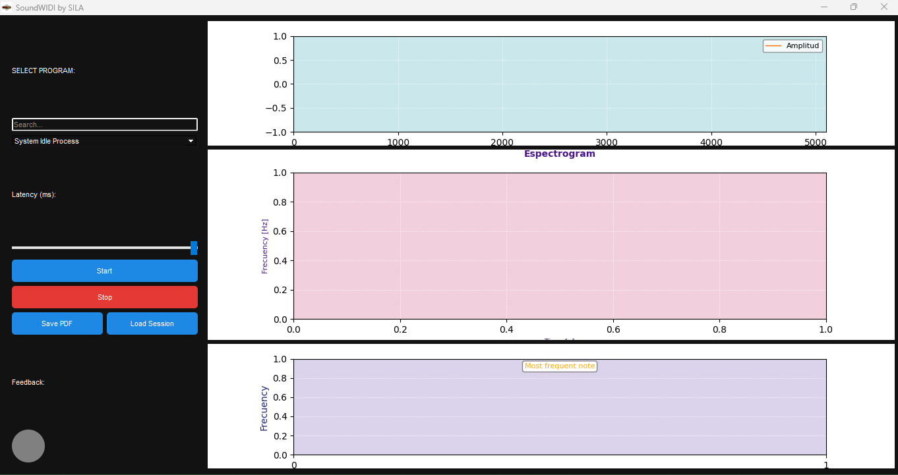
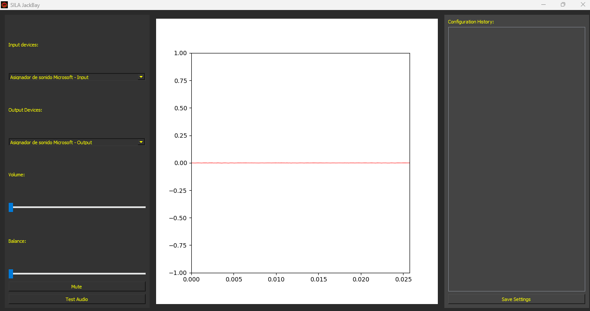
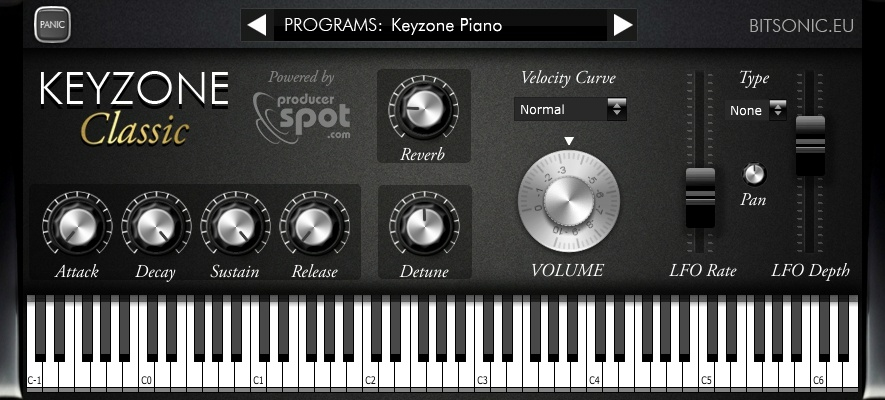
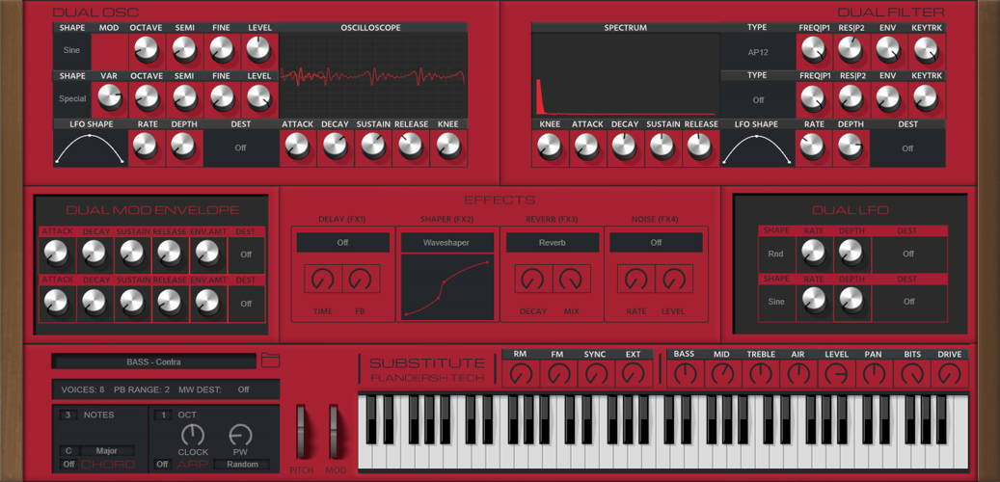

# SILA-Project (Studio Instrument Launch Assistant Project)

**Developed by Iván Ayub**

SILA-Project is a suite of integrated tools designed to optimize the management, customization, and execution of applications related to music production. This ecosystem includes multiple components, with **SILA-Box** as the main solution that combines these tools into a single accessible and practical launcher.

---

## Download

[Download SILA-Box.exe Installer (full launcher) in .zip format from Google Drive](https://drive.google.com/file/d/10-vr2CDccNHA8NFxWzBiYF8aFA3jAXPM/view?usp=sharing)

If you prefer to download only one of the .exe programs from Google Drive in .zip format, choose the one you need:

- [SILA GUI](https://drive.google.com/file/d/1uJU4i4RBaJkYdUtZTU72CY-clHwUGidA/view?usp=sharing)
- [Simple EQ-SILA](https://drive.google.com/file/d/16THjdA2u-J6wk4Yh0wuk0IezjaCBGH-1/view?usp=sharing)
- [ExtenSILA](https://drive.google.com/file/d/1si7FycWNTgUNBKJO4SO55QbDEdzEzuBM/view?usp=sharing)
- [SoundWIDI by SILA](https://drive.google.com/file/d/151k4GCtrT6X2nZhyNVQQGpCISYFaTj6P/view?usp=sharing)
- [SILA KeyMap](https://drive.google.com/file/d/1_QkzKV1flfWoyzq4-YYqfLYhQswDot2j/view?usp=sharing)
- [SILA JackBay](https://drive.google.com/file/d/13kNHl2OjiSM1FbGh1I2OaEqi3LRzw5Co/view?usp=sharing)
- [SILA VST Backup](https://drive.google.com/file/d/1bSRb0vXf-oTnlGlFlwOYnbPEUM-XQvka/view?usp=sharing)

### **For a detailed description of the features of each tool, refer to the corresponding document.**

For inquiries or comments, feel free to contact me at: [sellocasadenubes@gmail.com](mailto:sellocasadenubes@gmail.com).

---

### General Description

SILA-Project is primarily designed for **enthusiasts and beginners in music production**. This suite of tools is ideal for those who lack advanced resources, software, or equipment to get started in this field. Additionally, it perfectly complements basic audio editing programs like **Audacity**, **Ocenaudio**, and **WavePad**, offering additional features that enhance the creative process.

**SILA-Box** acts as a centralized launcher, providing quick and easy access to all the tools in the ecosystem, thus optimizing the user’s workflow.

---

# SILA-Box

**Developed by Iván Ayub**

## Key Features

- **Intuitive Interface:** Modern and user-friendly design that simplifies navigation.
- **Quick Program Launch:** Run multiple applications from a single centralized access point.
- **Icon Customization:** Quickly identify programs thanks to personalized icons.
- **Error Management:** Informative messages to facilitate troubleshooting.
- **Configuration Storage:** User preferences and settings are saved in the `AppData` directory.
- **Audacity Installation:** Direct access to download and install Audacity, easily integrating it into your workflow.

---

### Legal Notice

SILA-Box includes a button to install Audacity as one of the many options within the SILA-Project ecosystem.

- **Audacity** is open-source software developed and maintained by its community.
- **SILA-Project, SILA-Box, and developer Iván Ayub are not responsible for its development or official distribution.**

The purpose of including this option is to facilitate the use of SILA-Project within a default DAW without altering or modifying the original software.

---

### How to Use SILA-Box

1. **Main Window:**

   - Find buttons organized by studio tools and applications.
   - Identify each program through its icon and name.

2. **Launch Programs:**

   - Click on the desired program button to start it.
   - If an error occurs, a message will display details of the issue.

3. **Install Audacity:**

   - Click on the "Install Audacity" button to access the official installer and set up this tool on your computer.

4. **Manage Icons:**
   - Icons are loaded from the `resources` folder.
   - If an icon is unavailable, a default icon is assigned.

---

### Screenshots

---

### Frequently Asked Questions (FAQ)

1. **What is SILA-Project?**
   SILA-Project is a suite of tools designed to facilitate music production, with **SILA-Box** serving as the primary launcher.

2. **What types of files can I run with SILA-Box?**
   SILA-Box is designed to execute executable files (.exe).

3. **How can I add more programs to SILA-Box?**
   Programs must be manually added to the configuration file in the source code.

4. **What happens if a program doesn’t run correctly?**
   SILA-Box will display a message with details about the error.

5. **Where are SILA-Box configuration data stored?**
   They are saved in the user’s `AppData` folder, where user settings are stored.

6. **Can I modify the program icons?**
   Yes, you can update the icon path in the program configuration.

---

### System Requirements

- **Operating System:** Windows 7 or higher.
- **Dependencies:**
  - Python 3.7 or higher.
  - PyQt5.

---

# SILA-GUI

**Developed by Iván Ayub**

**SILA-GUI** is an application designed to simplify the management and launch of software instruments in studio environments. With an intuitive graphical interface built in PyQt5, it allows users to add, manage, and run multiple executable files from a single place, maintaining efficient process control and offering additional features like exporting the instrument list to a CSV file.

---

### Key Features

- **File Explorer:** Navigate system directories to select and add instruments (.exe) to the application.
- **Instrument Management:** Add, remove, and launch instruments directly from the main interface. Each instrument has a dedicated button for easy execution.
- **Process Monitoring:** SILA-GUI continuously checks running processes and displays the status of each instrument.
- **Export to CSV:** Easily export instruments and their executable paths to a CSV file for backup or documentation.
- **Customized Interface:** Modern visual design with a dark color palette and bright text (yellow on black), ideal for long studio sessions.

---

### Interface User Guide

1. **Main Window:**
   The main window of SILA-GUI is divided into two sections:

   - **File Explorer (Left):** Allows navigation through the file system to select executable files (.exe). Includes buttons like "Back" and "Go to Root" for easier navigation.
   - **Main Area (Right):**
     - **Instrument List:** Displays each added instrument with its execution button and status indicator.
     - **Log Area:** Provides information and notifications about performed actions.
     - **Action Buttons:** Includes options like "Add Instrument," "Export to CSV," and "Settings."

2. **Add an Instrument:**

   - Navigate to an executable file (.exe) using the File Explorer.
   - Click "Add from Explorer" and assign a name to the instrument in the pop-up dialog.
   - The instrument will be added to the list with its corresponding execution button.

3. **Launch an Instrument:**

   - Click the button associated with the instrument in the main area.
   - The process status will be monitored, and the status indicator will turn green if the instrument is running.

4. **Export Instruments to CSV:**
   - Click "Export to CSV."
   - Select the location and file name to save the instrument list.
   - The data will be saved with the instrument name and executable path.

---

### Screenshots

---

### Frequently Asked Questions (FAQ)

1. **What type of files can I add to SILA-GUI?**
   Only executable files (.exe) can be added.

2. **How can I remove an instrument from the list?**
   Click "Delete" next to the instrument you wish to remove and confirm the action.

3. **What happens if I try to launch an instrument that is already running?**
   SILA-GUI monitors processes in real-time. If the instrument is already running, it will notify you in the log area and won’t start the process again.

4. **How do I export my instruments to a CSV file?**
   Click "Export to CSV" and select a location for the file.

5. **How can I change the program’s settings?**
   Currently, settings are not implemented, but the "Settings" button is available for future updates.

6. **Where are the added instruments stored?**
   Instruments are saved in a JSON file inside the user's system folder.

7. **What should I do if an instrument fails to launch?**
   Verify the executable path and check the log console for more details. If the issue persists, remove and re-add the instrument.

---

### System Requirements

- **Operating System:** Windows 7 or higher.
- **Dependencies:**
  - Python 3.7 or higher.
  - PyQt5.

---

# Simple EQSILA

**Developed by Iván Ayub**

## Key Features

- **Real-Time Audio Equalizer:** Apply and adjust frequency band gains in real-time.
- **Customizable Presets:** Quickly apply predefined presets such as "Cut Bass" or "Boost Treble" to adjust the audio.
- **Master Volume Control:** Adjust the overall audio output with a master volume slider.
- **Audio Playback:** Play loaded audio files with real-time effects applied.
- **Audio Export:** Export the processed audio to a file in various formats.
- **User-Friendly Interface:** Modern and clean design with sliders for each frequency band and a distortion indicator.

---

### Legal Notice

This software includes audio processing features designed to enhance the sound quality of your audio files. It is not affiliated with any third-party audio processing tools but integrates with libraries like PyDub and SoundDevice for audio playback.

---

### How to Use Simple EQSILA

1. **Main Window:**

   - The main window provides easy access to buttons for loading audio, playing, stopping, and exporting audio files.
   - The interface includes sliders for adjusting 10 frequency bands.

2. **Load Audio:**

   - Click the "Load Audio" button to select an audio file. Supported formats include `.mp3`, `.wav`, and `.flac`.

3. **Apply Presets:**

   - Use the "Presets" menu to apply audio presets like "Cut Bass" or "Boost Treble."

4. **Adjust Frequency Bands:**

   - Use the sliders to adjust the gain for each frequency band from -10 to +10 dB.

5. **Play Audio:**

   - Click "Play" to start the audio playback with the equalizer settings applied.

6. **Stop Audio:**

   - Click "Stop" to halt the audio playback.

7. **Export Audio:**
   - Click "Export Audio" to save the processed audio to a new file.

---

### Screenshots

---

### Frequently Asked Questions (FAQ)

1. **What is Simple EQSILA?**
   Simple EQSILA is a real-time audio equalizer that allows you to adjust the frequency bands of your audio files.

2. **What types of audio files can I load?**
   You can load `.mp3`, `.wav`, and `.flac` files into the program.

3. **How can I apply presets?**
   Use the "Presets" menu to apply different preset equalizer settings.

4. **How do I adjust the frequency bands?**
   Use the vertical sliders for each frequency band to adjust the gain from -10 to +10 dB.

5. **Can I export the audio after processing it?**
   Yes, you can export the modified audio to a file using the "Export Audio" button.

6. **Where is the audio file loaded?**
   The audio is loaded into memory after selecting a file, and it will be played back in real-time with the applied equalizer settings.

7. **What happens if there is distortion in the audio?**
   The program will display a distortion indicator, and if distortion occurs, it will show "Distortion: Yes" in red.

---

# ExtenSILA

**Developed by Iván Ayub**

**ExtenSILA** is a desktop application developed with PyQt5 for audio file conversion. The program supports **WAV**, **MP3**, and **FLAC** formats, allowing batch conversion of multiple files into the selected output format. It also includes options to switch between light and dark themes.

---

### Key Features

1. **Import Audio Files:** Select multiple audio files for conversion.
2. **Delete Selection:** Remove selected files from the conversion list.
3. **Choose Output Folder:** Define the directory where converted files will be saved.
4. **Select Output Format:** Convert to WAV, MP3, or FLAC formats.
5. **Batch Conversion:** Perform the conversion of multiple audio files in a single operation.
6. **Conversion Progress:** Includes a progress bar to display the current conversion status.
7. **Light/Dark Theme:** Allows switching between light and dark modes for better visual experience.

---

### User Guide

#### User Interface

- **Options Menu:**

  - Option to toggle between light and dark themes.

- **Main Area:**
  - **"Import Files" Button:** Select one or more audio files from the file system.
  - **"Delete Selection" Button:** Remove selected files from the conversion list.
  - **File List:** Displays imported files, allowing selection for further details.
  - **"Select Destination Folder" Button:** Choose the folder where converted files will be saved.
  - **"Output Format" ComboBox:** Dropdown menu to select the output format (WAV, MP3, or FLAC).
  - **"Convert" Button:** Starts the conversion of selected files to the chosen format.
  - **Progress Bar:** Displays real-time progress of the file conversion.

---

### Steps to Convert Audio Files

1. **Import Files:**

   - Click "Import Files" and select the desired files from your system.
   - The selected files will appear in the file list.

2. **Remove Unwanted Files:**

   - Select one or more files from the list and press "Delete Selection" to remove them, if needed.

3. **Select Output Folder:**

   - Click "Select Destination Folder" and choose the folder where the converted files will be saved.

4. **Choose Output Format:**

   - Select the desired output format (WAV, MP3, or FLAC) from the dropdown menu.

5. **Start Conversion:**

   - Click the "Convert" button to begin the conversion process. A progress bar will show the ongoing status.

6. **Wait and Review Results:**
   - Once the conversion is complete, a message will confirm the successful conversion. The files will be available in the selected folder.

---

### Toggle Light/Dark Theme

- Use the options menu to toggle between the light and dark themes for the user interface.

---

### Screenshots

---

### Error Handling

- If an error occurs during the conversion, a dialog box will display a detailed message.
   Common issues may include:
  - An unsupported file format.
  - Problems writing to the output folder.

---

### System Requirements

- **Operating System:** Windows 7 or higher.
- **Dependencies:**
  - Python 3.7 or higher.
  - PyQt5.

---

# SILA KeyMap

**Developed by Iván Ayub**

**SILA KeyMap** is an application designed to capture keystrokes and send MIDI messages through a selected MIDI port. The interface allows users to select instruments, adjust velocity and volume, and visualize active keys in real-time. This tool is ideal for musicians and composers seeking a simple way to map their keyboard to MIDI notes.

---

### Key Features

1. **Keystroke Capture:** Real-time capture of keyboard presses.
2. **MIDI Messages:** Sends MIDI messages through a selected MIDI port.
3. **Instrument Selector:** Choose from various MIDI instruments.
4. **Customizable Controls:** Adjust velocity, master volume, and octave settings.
5. **Real-Time Visualization:** Shows active keys and transmitted notes.

---

### User Guide

#### User Interface

The **SILA KeyMap** interface is composed of several elements:

- **Title and Description:**
  Displays the application’s title and usage instructions.

- **Status:**
  Indicates the current keystroke capture status (active/inactive).

- **Buttons:**

  - **Start Capture:** Begins capturing keyboard presses.
  - **Exit:** Closes the application.

- **MIDI Port Selector:**
  Allows the selection of an available MIDI port.

- **Instrument Controls:**

  - **MIDI Instrument:** Slider to choose the instrument.
  - **Velocity:** Slider to adjust the note velocity.
  - **Master Volume:** Slider to adjust the overall volume.
  - **Octave:** Slider to adjust the note octave.

- **Active Keys Visualizer:**
  Displays currently active keys.

- **Note Visualizer:**
  Shows the note currently being sent.

---

### Steps to Use the Application

1. **Select MIDI Port:**

   - Choose a MIDI port from the dropdown list.

2. **Start Capture:**

   - Click the "Start Capture" button to begin capturing keyboard presses.

3. **Press Keys:**

   - Press keys from "a" to "z" to send MIDI messages.

4. **Adjust Controls:**

   - Modify instrument, velocity, and volume settings as needed.

5. **Finish:**
   - Click "Exit" to close the application.

---

### Screenshots

---

### Frequently Asked Questions (FAQ)

1. **How can I change the MIDI instrument?**

   - Use the "MIDI Instrument" slider to select the desired instrument.

2. **Why can’t I see any available MIDI ports?**

   - Ensure your MIDI device is properly connected, and the drivers are installed. If no ports are found, the application will display "No MIDI ports available."

3. **What keys are mapped to MIDI notes?**

   - Keys "q" to "m" are mapped to various MIDI notes in the corresponding octave. Check the source code for detailed mappings.

4. **Can I use keyboards other than my connected MIDI device?**

   - Yes, any keyboard recognized as an input device on your system can be used, as long as it supports MIDI.

5. **What should I do if the application is unresponsive?**
   - Restart the application. If the issue persists, check for conflicts with other MIDI devices or drivers.

---

### System Requirements

- **Operating System:** Windows 7 or higher.
- **Dependencies:**
  - Python 3.7 or higher.
  - Required libraries for MIDI and GUI.

---

# SoundWIDI by SILA

**Developed by Iván Ayub**

**SoundWIDI** is a sound monitoring tool that allows capturing and visualizing audio from applications in real-time. It provides waveform graphs, spectrograms, and a note histogram to facilitate sound analysis. Additionally, it allows saving monitoring sessions in PDF format.

---

### Key Features

1. **Real-Time Audio Monitoring:** Captures and visualizes audio from running applications.
2. **Graphical Visualization:** Includes waveform graphs, spectrograms, and a note histogram.
3. **Session Management:** Allows saving sessions in PDF format and loading previous sessions.
4. **Customizable Controls:** Adjust audio latency to suit user needs.

---

### User Guide

#### User Interface

The **SoundWIDI** interface is divided into two main sections: the control panel and the graphics area.

- **Control Panel:**

  - **Select Application:** Choose from the system’s running applications. Use the search bar to filter applications.
  - **Latency:** Slider to adjust latency in milliseconds.
  - **Start/Stop Buttons:**
    - **Start:** Begins capturing audio from the selected application.
    - **Stop:** Stops audio capture.
  - **Save PDF / Load Session:** Buttons to save the current session to a PDF file or load a previously saved session.

- **Graphics Area:**

  - **Waveform Graph:** Displays the audio waveform in real-time.
  - **Spectrogram:** Visualizes audio frequencies over time.
  - **Note Histogram:** Shows the frequency of notes captured in the audio.

- **Visual Feedback:**
  - An indicator showing the monitoring status.

---

### Steps to Use the Application

1. **Select Application:**

   - Choose a running application from the dropdown list or search for it using the search bar.

2. **Configure Latency:**

   - Use the latency slider to adjust the delay according to your preference.

3. **Start Monitoring:**

   - Click the "Start" button to begin capturing audio.

4. **Analyze Graphics:**

   - Observe the real-time graphs to analyze the audio.

5. **Save Session:**

   - Click "Save PDF" to export the results.

6. **Load Session:**

   - Use the "Load Session" button to review saved sessions.

7. **Stop Monitoring:**
   - Click the "Stop" button to end audio capture.

---

### Screenshots

---

### Frequently Asked Questions (FAQ)

1. **What if the program doesn’t detect open applications?**

   - Ensure that the applications are running and that you have the necessary permissions to access them.

2. **Can I adjust the quality of the captured audio?**

   - Audio quality can be adjusted through the latency slider. Lower latency reduces delay but may increase resource usage.

3. **How do I save a session?**

   - Click the "Save PDF" button and select a location for the file. The session will be saved as a PDF document containing the waveform, spectrogram, and note histogram graphs.

4. **Can I load saved sessions?**

   - Yes, use the "Load Session" button to open previously saved sessions.

5. **What should I do if errors occur during execution?**
   - Check the console for specific error messages. Ensure all required libraries are installed and that the program has permissions to access audio.

---

### System Requirements

- **Operating System:** Windows 10 or higher.
- **Dependencies:**
  - Python 3.8 or higher.
  - Libraries for audio analysis and graphical visualization.

---

# SILA JackBay

**Developed by Iván Ayub**

**SILA JackBay** is an application designed for real-time management and control of audio devices. It allows selecting input and output devices, adjusting volume and balance, and visualizing audio levels through graphs.

---

### Key Features

- **Input and Output Device Selection:** Choose audio input and output devices.
- **Volume and Balance Control:** Adjust volume levels and stereo balance.
- **Mute Function:** Mute audio with a toggle button.
- **Audio Test Function:** Play a test signal to verify audio output.
- **Configuration History:** Save and apply audio settings using a history log.
- **Real-Time Audio Visualization:** Display audio levels graphically in real-time.

---

### User Guide

#### Main Interface

The interface is divided into three main sections:

1. **Left Panel:** Contains controls for selecting audio devices, as well as volume and balance adjustments.

   - **Input Devices:** Dropdown menu to choose the audio input device.
   - **Output Devices:** Dropdown menu to select the audio output device.
   - **Volume and Balance Controls:** Sliders to adjust volume and stereo balance.
   - **Control Buttons:**
     - **Mute:** Toggles audio muting on/off.
     - **Test Audio:** Plays a test signal to verify the audio configuration.

2. **Central Area:** Displays real-time audio levels through graphical visualization.

3. **Right Panel:** Shows the history of saved audio configurations.
   - **Configuration History:** Lists saved settings, allowing quick application by double-clicking.
   - **Save Configuration Button:** Saves the current settings to the history log.

---

### How to Use

1. **Select Devices:**

   - Use the dropdown menus on the left panel to select the desired input and output devices.

2. **Adjust Volume and Balance:**

   - Use the sliders to set volume levels and stereo balance to your preference.

3. **Mute/Unmute Audio:**

   - Click the "Mute" button to mute the audio. The button text will change to "Unmute" to indicate the state.

4. **Test Audio:**

   - Click the "Test Audio" button to generate a test sound and verify the audio output.

5. **Save Configuration:**

   - Click "Save Configuration" to save the current settings to the history log.

6. **Apply Saved Configuration:**

   - Double-click a configuration in the history log to apply it immediately.

7. **Close the Application:**
   - Close the application by clicking the window’s close button. Audio streams will stop automatically.

---

### Screenshots

---

### Frequently Asked Questions (FAQ)

1. **How can I select an input or output device?**

   - Use the dropdown menus on the left panel to select the desired devices. Ensure the device has available channels.

2. **What should I do if no sound is heard?**

   - Verify the selected output device, ensure the volume is not muted, and test the audio using the "Test Audio" button.

3. **How can I save a configuration?**
   - Adjust the settings as needed and click "Save Configuration." The settings will appear in the history log on the right panel.

---

### System Requirements

- **Operating System:** Windows 10 or higher.
- **Dependencies:**
  - Python 3.8 or higher.
  - Required libraries for audio handling and graphical visualization.

---

EXTRA

# Instrument Combo by SILA

## Instruments Recommended by SILA Project

Here you will find a list of virtual instruments recommended by the SILA Project team for your musical projects. Each instrument includes a direct link for download or access, relevant information, and details about its developer.

### Legal Notices

1. All the instruments mentioned here are the property of their respective developers.
2. SILA Project is not affiliated with the listed tools and is not responsible for their use.
3. Review the usage licenses of each tool before implementing them in your projects.

### Recommended Instruments List

1. **[Surge](https://surge-synthesizer.github.io/)**

   - **Description:** Surge is a free and open-source hybrid synthesizer with a wide range of sound possibilities.
   - **Developer:** Surge Synth Team
     

2. **[LABS](https://labs.spitfireaudio.com/download)**

   - **Description:** A collection of experimental and unique instruments developed by Spitfire Audio.
   - **Developer:** Spitfire Audio
     

3. **[Dexed](https://asb2m10.github.io/dexed/)**

   - **Description:** An emulation of the famous Yamaha DX7 synthesizer, ideal for classic FM sounds.
   - **Developer:** Digital Suburban
     

4. **[Keyzone Classic](https://plugins4free.com/plugin/2848/)**

   - **Description:** A virtual piano that includes acoustic and electric piano sounds.
   - **Developer:** Bitsonic
     

5. **[GR-8](https://plugins4free.com/plugin/3491/)**

   - **Description:** A powerful and versatile virtual synthesizer with multiple oscillators.
   - **Developer:** Phuturetone
     

6. **[Sonigen Modular](https://plugins4free.com/plugin/1005/)**

   - **Description:** A modular synthesizer where you can build your own sounds from scratch.
   - **Developer:** Sonigen
     

7. **[Substitute](https://plugins4free.com/plugin/3918/)**

   - **Description:** A synthesizer based on waveforms and wavetable synthesis.
   - **Developer:** de la Mancha
     

8. **[Vital](https://vital.audio/)**
   - **Description:** An advanced wavetable synthesizer with an intuitive and powerful interface.
   - **Developer:** Matt Tytel
     
