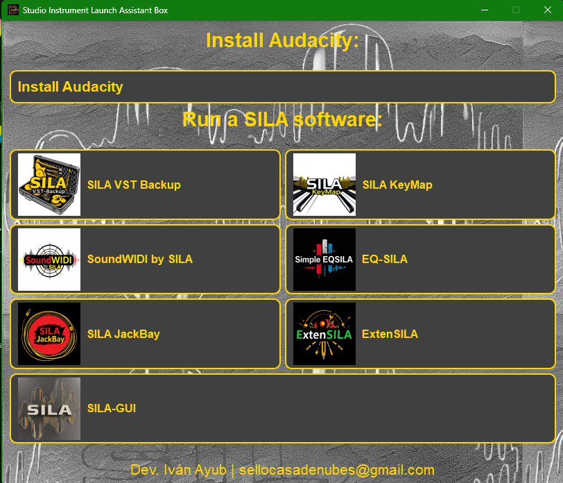

# SILA-Project (Studio Instrument Launch Assistant Project)

**Desarrollado por Iván Ayub**

SILA-Project es un conjunto de herramientas integradas diseñadas para optimizar la gestión, personalización y ejecución de aplicaciones relacionadas con la producción musical. Este ecosistema incluye múltiples componentes, siendo **SILA-Box** la solución principal que combina estas herramientas en un único launcher accesible y práctico.

---

## Descarga

[Descargar SILA-Box.exe Installer (launcher completo) en formato .zip desde Google Drive](https://drive.google.com/file/d/10-vr2CDccNHA8NFxWzBiYF8aFA3jAXPM/view?usp=sharing)

Si prefieres descargar únicamente alguno de los programas .exe desde Google Drive en .zip, elige el que necesites:

- [SILA GUI](https://drive.google.com/file/d/1uJU4i4RBaJkYdUtZTU72CY-clHwUGidA/view?usp=sharing)
- [Simple EQ-SILA](https://drive.google.com/file/d/16THjdA2u-J6wk4Yh0wuk0IezjaCBGH-1/view?usp=sharing)
- [ExtenSILA](https://drive.google.com/file/d/1si7FycWNTgUNBKJO4SO55QbDEdzEzuBM/view?usp=sharing)
- [SoundWIDI by SILA](https://drive.google.com/file/d/151k4GCtrT6X2nZhyNVQQGpCISYFaTj6P/view?usp=sharing)
- [SILA KeyMap](https://drive.google.com/file/d/1_QkzKV1flfWoyzq4-YYqfLYhQswDot2j/view?usp=sharing)
- [SILA JackBay](https://drive.google.com/file/d/13kNHl2OjiSM1FbGh1I2OaEqi3LRzw5Co/view?usp=sharing)
- [SILA VST Backup](https://drive.google.com/file/d/1bSRb0vXf-oTnlGlFlwOYnbPEUM-XQvka/view?usp=sharing)

### **Para obtener una descripción detallada de las funciones de cada herramienta, consulta el documento correspondiente en este README.**

### **Al final, se incluye Instrument Combo by SILA: una selección curada de instrumentos virtuales recomendados por SILA Project.**

Para consultas o comentarios, no dudes en contactarme a través de: [sellocasadenubes@gmail.com](mailto:sellocasadenubes@gmail.com).

---

## Descripción General

SILA-Project está diseñado principalmente para **entusiastas y principiantes en la producción musical**. Este conjunto de herramientas es ideal para quienes no disponen de los recursos, software o equipos avanzados necesarios para comenzar en este ámbito. Además, complementa perfectamente programas básicos de edición de audio como **Audacity**, **Ocenaudio** y **WavePad**, ofreciendo funciones adicionales que potencian el proceso creativo.

**SILA-Box** actúa como un launcher centralizado, proporcionando acceso rápido y sencillo a todas las herramientas del ecosistema, optimizando así el flujo de trabajo del usuario.

---

# SILA-Box

**Desarrollado por Iván Ayub**

## Características Principales

- **Interfaz Intuitiva:** Diseño moderno y fácil de usar que facilita la navegación.
- **Lanzamiento Rápido de Programas:** Ejecuta múltiples aplicaciones desde un único acceso centralizado.
- **Personalización de Iconos:** Identificación rápida de programas gracias a iconos personalizados.
- **Gestión de Errores:** Mensajes informativos para facilitar la resolución de problemas.
- **Almacenamiento de Configuración:** Las preferencias y configuraciones del usuario se guardan en el directorio `AppData`.
- **Instalación de Audacity:** Acceso directo para descargar e instalar Audacity, integrándolo fácilmente en tu flujo de trabajo.

---

## Aviso Legal

SILA-Box incluye un botón para instalar Audacity como una de las muchas opciones dentro del ecosistema SILA-Project.

- **Audacity** es un software de código abierto desarrollado y mantenido por su comunidad.
- **SILA-Project, SILA-Box y el desarrollador Iván Ayub no son responsables de su desarrollo o distribución oficial.**

El objetivo de incluir esta opción es facilitar el uso de SILA-Project dentro de un DAW por defecto, sin alterar ni modificar el software original.

---

## Cómo Usar SILA-Box

1. **Ventana Principal:**

   - Encuentra los botones organizados por herramientas y aplicaciones de estudio.
   - Identifica cada programa mediante su icono y nombre.

2. **Lanzamiento de Programas:**

   - Haz clic en el botón del programa deseado para iniciarlo.
   - Si ocurre algún error, se mostrará un mensaje con detalles del problema.

3. **Instalar Audacity:**

   - Haz clic en el botón "Instalar Audacity" para acceder al instalador oficial y configurar esta herramienta en tu computadora.

4. **Gestión de Iconos:**
   - Los iconos se cargan desde la carpeta `resources`.
   - Si un icono no está disponible, se asigna un icono por defecto.

---

## Capturas

---

## Preguntas Frecuentes (FAQ)

1. **¿Qué es SILA-Project?**
   SILA-Project es un conjunto de herramientas diseñadas para facilitar la producción musical, con **SILA-Box** como launcher principal.

2. **¿Qué tipo de archivos puedo ejecutar con SILA-Box?**
   SILA-Box está diseñado para ejecutar archivos ejecutables (.exe).

3. **¿Cómo puedo agregar más programas a SILA-Box?**
   Los programas deben agregarse manualmente al archivo de configuración en el código fuente.

4. **¿Qué sucede si un programa no se ejecuta correctamente?**
   SILA-Box mostrará un mensaje con detalles sobre el error ocurrido.

5. **¿Dónde se guardan los datos de configuración de SILA-Box?**
   Se almacenan en la carpeta `AppData` del usuario, donde se guardan las configuraciones del usuario.

6. **¿Puedo modificar los iconos de los programas?**
   Sí, puedes actualizar la ruta del icono en la configuración del programa.

---

## Requisitos del Sistema

- **Sistema Operativo:** Windows 7 o superior.
- **Dependencias:**
  - Python 3.7 o superior.
  - PyQt5.

---

# SILA-GUI

**Desarrollado por Iván Ayub**

**SILA-GUI** es una aplicación diseñada para simplificar la gestión y lanzamiento de instrumentos de software en entornos de estudio. Con una interfaz gráfica intuitiva construida en PyQt5, permite a los usuarios agregar, gestionar y ejecutar múltiples archivos ejecutables desde un único lugar, manteniendo un control eficiente de los procesos en ejecución y ofreciendo funciones adicionales como la exportación de la lista de instrumentos a un archivo CSV.

---

### Características Principales

- **Explorador de Archivos:** Navega por los directorios del sistema para seleccionar y agregar instrumentos (.exe) a la aplicación.
- **Gestión de Instrumentos:** Permite añadir, eliminar y lanzar instrumentos desde la interfaz principal. Cada instrumento tiene un botón dedicado para su fácil ejecución.
- **Monitoreo de Procesos:** SILA-GUI verifica continuamente los procesos en ejecución y muestra el estado de cada instrumento.
- **Exportación a CSV:** Los instrumentos y sus rutas ejecutables pueden exportarse fácilmente a un archivo CSV para respaldo o documentación.
- **Interfaz Personalizada:** Diseño visual moderno con una paleta de colores oscuros y texto brillante (amarillo sobre negro), ideal para largas sesiones de trabajo en estudio.

---

### Manual de Uso de la Interfaz

1. **Ventana Principal:**
   La ventana principal de SILA-GUI está dividida en dos secciones:

   - **Explorador de Archivos (izquierda):** Permite navegar por el sistema de archivos para seleccionar archivos ejecutables (.exe). Incluye botones como "Back" y "Go to Root" para facilitar la navegación.
   - **Área Principal (derecha):**
     - **Lista de Instrumentos:** Muestra cada instrumento agregado con su botón de ejecución e indicador de estado.
     - **Área de Registro:** Proporciona información y notificaciones sobre las acciones realizadas.
     - **Botones de Acción:** Incluyen opciones como "Añadir Instrumento", "Exportar a CSV" y "Configuraciones".

2. **Añadir un Instrumento:**

   - Navega a un archivo ejecutable (.exe) desde el Explorador de Archivos.
   - Haz clic en "Add from Explorer" y asigna un nombre al instrumento en el cuadro de diálogo que aparece.
   - El instrumento se añadirá a la lista con su botón de ejecución correspondiente.

3. **Lanzar un Instrumento:**

   - Haz clic en el botón asociado al instrumento desde el área principal.
   - El estado del proceso será monitoreado, y el indicador de estado cambiará a verde si el instrumento está en ejecución.

4. **Exportar Instrumentos a CSV:**
   - Haz clic en "Export to CSV".
   - Selecciona la ubicación y el nombre del archivo para guardar la lista de instrumentos.
   - Los datos se guardarán con el nombre del instrumento y la ruta del ejecutable.

---

## Capturas

---

### FAQ - Preguntas Frecuentes

1. **¿Qué tipo de archivos puedo agregar a SILA-GUI?**
   Solo se pueden agregar archivos ejecutables (.exe).

2. **¿Cómo puedo eliminar un instrumento de la lista?**
   Haz clic en "Delete" junto al instrumento que desees eliminar y confirma la acción.

3. **¿Qué pasa si intento lanzar un instrumento que ya está en ejecución?**
   SILA-GUI monitorea los procesos en tiempo real. Si el instrumento ya está corriendo, se notificará en el área de registro y no se ejecutará nuevamente.

4. **¿Cómo exporto mis instrumentos a un archivo CSV?**
   Haz clic en "Export to CSV" y selecciona una ubicación para el archivo.

5. **¿Cómo cambio la configuración del programa?**
   Actualmente, las configuraciones no están implementadas, pero el botón "Settings" está disponible para futuras actualizaciones.

6. **¿Dónde se guardan los instrumentos que añado?**
   Los instrumentos se guardan en un archivo JSON dentro de la carpeta de usuario del sistema.

7. **¿Qué hago si un instrumento no se lanza correctamente?**
   Verifica la ruta del ejecutable y revisa la consola de registros para más detalles. Si el problema persiste, elimina y vuelve a agregar el instrumento.

---

### Requisitos del Sistema

- **Sistema Operativo:** Windows 7 o superior.
- **Dependencias:**
  - Python 3.7 o superior.
  - PyQt5.

---

# Simple EQSILA

**Desarrollado por Iván Ayub**

## Características Principales

- **Interfaz Intuitiva:** Diseño moderno y fácil de usar que simplifica la navegación.
- **Ecualización en Tiempo Real:** Ajusta las ganancias de las bandas de frecuencia mientras escuchas la música.
- **Presets:** Incluye varios ajustes predeterminados para facilidad de uso, como "Cut Bass", "Boost Treble", entre otros.
- **Control de Volumen:** Ajuste de volumen maestro y control de distorsión.
- **Compatibilidad de Formatos:** Carga y exporta archivos de audio en varios formatos, como WAV, MP3 y FLAC.
- **Interfaz de Usuario Personalizable:** Puedes modificar las configuraciones y los iconos según tus preferencias.

---

### Aviso Legal

**Simple EQSILA** incluye la capacidad de cargar y reproducir archivos de audio, aplicar ecualización en tiempo real y exportar el audio modificado.

- **Simple EQSILA** es una herramienta de código abierto, y sus funcionalidades son proporcionadas sin garantías de ningún tipo.

---

### Cómo Usar Simple EQSILA

1. **Ventana Principal:**

   - En la ventana principal, encontrarás botones organizados por herramientas y aplicaciones.
   - Cada programa se identifica por su icono y nombre.

2. **Cargar y Reproducir Audio:**

   - Haz clic en el botón "Load Audio" para cargar un archivo de audio.
   - Haz clic en "Play" para reproducir el audio con la ecualización en tiempo real aplicada.
   - Si el audio no se carga correctamente, aparecerá un mensaje de error.

3. **Aplicar un Preset:**
   - Accede al menú "Presets" y selecciona uno de los ajustes predefinidos (por ejemplo, "Cut Bass" o "Boost Treble") para aplicar rápidamente una configuración de ecualización.
4. **Ajustar las Bandas de Frecuencia:**

   - Usa los deslizadores para ajustar las ganancias de las distintas bandas de frecuencia entre -10 y +10 dB.

5. **Ajustar el Volumen Maestro:**
   - Modifica el volumen general de la salida de audio utilizando el control deslizante de volumen maestro.
6. **Exportar Audio:**
   - Después de realizar ajustes, haz clic en "Export Audio" para guardar el archivo de audio modificado.

---

### Capturas de Pantalla

---

### Preguntas Frecuentes (FAQ)

1. **¿Qué es Simple EQSILA?**
   Simple EQSILA es una herramienta de ecualización en tiempo real para audio, diseñada para ajustar el sonido con precisión utilizando múltiples bandas de frecuencia.

2. **¿Qué tipos de archivos puedo cargar?**
   Simple EQSILA es compatible con archivos de audio en formatos como MP3, WAV y FLAC.

3. **¿Puedo personalizar los iconos de las aplicaciones?**
   Sí, los iconos utilizados en la interfaz pueden ser modificados desde el archivo de configuración.

4. **¿Cómo puedo agregar más programas a Simple EQSILA?**
   Los programas se deben agregar manualmente en el código fuente del programa.

5. **¿Dónde se almacenan los datos de configuración de Simple EQSILA?**
   Los datos de configuración se guardan en la carpeta `AppData` del usuario.

6. **¿Qué hacer si el audio no se reproduce correctamente?**
   Si se detecta un error durante la reproducción, el programa mostrará un mensaje con los detalles del problema.

---

# ExtenSILA

**Desarrollado por Iván Ayub**

---

## Características Principales

1. **Importar Archivos de Audio:** Permite seleccionar múltiples archivos de audio para convertir.
2. **Eliminar Selección:** Opción para eliminar archivos seleccionados de la lista de conversión.
3. **Seleccionar Carpeta de Salida:** Permite definir el directorio donde se guardarán los archivos convertidos.
4. **Seleccionar Formato de Salida:** Ofrece la conversión a formatos WAV, MP3 y FLAC.
5. **Conversión en Lotes:** Realiza la conversión de múltiples archivos de audio en una sola operación.
6. **Progreso de Conversión:** Incluye una barra de progreso que muestra el estado actual de la conversión.
7. **Tema Oscuro/Claro:** Proporciona la posibilidad de alternar entre los temas claro y oscuro para mejorar la experiencia visual.

---

## Manual de Uso

### Interfaz de Usuario

- **Menú de Opciones:**

  - Opción para alternar entre los temas oscuro y claro.

- **Área Principal:**
  - **Botón "Importar Archivos":** Permite seleccionar uno o más archivos de audio desde el sistema de archivos.
  - **Botón "Eliminar Selección":** Elimina los archivos seleccionados de la lista de conversión.
  - **Lista de Archivos:** Muestra los archivos importados, permitiendo seleccionarlos para ver más detalles.
  - **Botón "Seleccionar Carpeta de Destino":** Permite seleccionar la carpeta donde se guardarán los archivos convertidos.
  - **ComboBox "Formato de Salida":** Lista desplegable para elegir el formato de salida (WAV, MP3 o FLAC).
  - **Botón "Convertir":** Inicia la conversión de los archivos seleccionados al formato elegido.
  - **Barra de Progreso:** Muestra el avance de la conversión de archivos en tiempo real.

### Pasos para Convertir Archivos de Audio

1. **Importar Archivos:**

   - Haz clic en "Importar Archivos" y selecciona los archivos deseados desde tu sistema.
   - Los archivos seleccionados aparecerán en la lista de archivos.

2. **Eliminar Archivos No Deseados:**

   - Selecciona uno o más archivos en la lista y presiona "Eliminar Selección" para eliminarlos si es necesario.

3. **Seleccionar Carpeta de Salida:**

   - Haz clic en "Seleccionar Carpeta de Destino" y selecciona la carpeta donde se guardarán los archivos convertidos.

4. **Elegir el Formato de Salida:**

   - Selecciona el formato de salida deseado (WAV, MP3, FLAC) desde el menú desplegable.

5. **Iniciar Conversión:**

   - Haz clic en el botón "Convertir" para comenzar la conversión. Se mostrará una barra de progreso indicando el avance.

6. **Esperar y Revisar Resultados:**
   - Una vez completada la conversión, un mensaje confirmará que los archivos se han convertido correctamente. Los archivos estarán disponibles en la carpeta seleccionada.

### Alternar Tema Claro/Oscuro

- En el menú de opciones, selecciona "Alternar tema claro/oscuro" para cambiar entre los modos de visualización oscuro y claro.

---

## Capturas

---

## Manejo de Errores

- Si ocurre un error durante la conversión, aparecerá un cuadro de diálogo mostrando un mensaje detallado. Esto puede deberse a:
  - Un archivo no compatible.
  - Problemas al escribir en la carpeta de salida.

---

## Requisitos del Sistema

- **Sistema Operativo:** Windows 7 o superior.
- **Dependencias:**
  - Python 3.7 o superior.
  - PyQt5.

---

# SILA KeyMap

**Desarrollado por Iván Ayub**

**SILA KeyMap** es una aplicación diseñada para capturar las pulsaciones de teclas y enviar mensajes MIDI a través de un puerto MIDI seleccionado. La interfaz permite a los usuarios seleccionar instrumentos, ajustar la velocidad y el volumen, y visualizar las teclas activas en tiempo real. Esta herramienta es ideal para músicos y compositores que buscan una manera sencilla de mapear su teclado a notas MIDI.

---

## Características Principales

1. **Captura de Teclas:** Captura las pulsaciones del teclado en tiempo real.
2. **Mensajes MIDI:** Envía mensajes MIDI a través de un puerto MIDI seleccionado.
3. **Selector de Instrumentos:** Permite elegir entre distintos instrumentos MIDI.
4. **Controles Personalizables:** Ajusta velocidad, volumen maestro y octava.
5. **Visualización en Tiempo Real:** Muestra las teclas activas y las notas enviadas.

---

## Manual de Uso

### Interfaz de Usuario

La interfaz de usuario de **SILA KeyMap** se compone de varios elementos:

- **Título y Descripción:**

  - Muestra el título de la aplicación y las instrucciones de uso.

- **Estado:**

  - Indica el estado actual de la captura de teclas (activa/inactiva).

- **Botones:**

  - **Iniciar Captura:** Comienza a capturar las pulsaciones de las teclas.
  - **Salir:** Cierra la aplicación.

- **Selector de Puerto MIDI:**

  - Permite seleccionar un puerto MIDI disponible.

- **Controles de Instrumento:**

  - **Instrumento MIDI:** Control deslizante para seleccionar el instrumento.
  - **Velocidad:** Control deslizante para ajustar la velocidad de las notas MIDI.
  - **Volumen Maestro:** Control deslizante para ajustar el volumen general.
  - **Octava:** Control deslizante para ajustar la octava de las notas.

- **Visualizador de Teclas Activas:**

  - Muestra las teclas que están actualmente activas.

- **Visualizador de Notas:**
  - Muestra la nota que se está enviando actualmente.

### Pasos para Usar la Aplicación

1. **Seleccionar Puerto MIDI:**

   - Elige un puerto MIDI de la lista desplegable.

2. **Iniciar Captura:**

   - Haz clic en el botón "Iniciar Captura" para comenzar a capturar las pulsaciones de las teclas.

3. **Presionar Teclas:**

   - Presiona las teclas de "a" a "z" para enviar mensajes MIDI.

4. **Ajustar Controles:**

   - Modifica los controles para el instrumento, velocidad y volumen según sea necesario.

5. **Finalizar:**
   - Haz clic en "Salir" para cerrar la aplicación.

---

## Capturas

---

## Preguntas Frecuentes (FAQ)

1. **¿Cómo puedo cambiar el instrumento MIDI?**

   - Puedes ajustar el instrumento MIDI utilizando el control deslizante "Instrumento MIDI". Simplemente mueve el control para seleccionar el instrumento deseado.

2. **¿Por qué no puedo ver ningún puerto MIDI disponible?**

   - Asegúrate de que tu dispositivo MIDI esté correctamente conectado y que los controladores estén instalados. La aplicación mostrará "No hay puertos MIDI disponibles" si no encuentra ninguno.

3. **¿Qué teclas están mapeadas a las notas MIDI?**

   - Las teclas de "q" a "m" están mapeadas a varias notas MIDI en la octava correspondiente. Puedes consultar el código fuente para ver la asignación exacta.

4. **¿Puedo utilizar otros teclados además del que tengo conectado?**

   - Sí, puedes utilizar cualquier teclado que esté configurado como un dispositivo de entrada en tu sistema, siempre que se reconozca como un dispositivo MIDI.

5. **¿Qué hacer si la aplicación no responde?**
   - Intenta reiniciar la aplicación. Si el problema persiste, verifica si hay conflictos con otros dispositivos MIDI o controladores.

---

## Requisitos del Sistema

- **Sistema Operativo:** Windows 7 o superior.
- **Dependencias:**
  - Python 3.7 o superior.
  - Bibliotecas necesarias para MIDI y GUI.

---

# SoundWIDI by SILA

**Desarrollado por Iván Ayub**

**SoundWIDI** es una herramienta de monitoreo de sonido que permite capturar y visualizar el audio de aplicaciones en tiempo real. Proporciona gráficos de forma de onda, espectrogramas y un histograma de notas para facilitar el análisis del sonido. Además, permite guardar las sesiones de monitoreo en formato PDF.

---

## Características Principales

1. **Monitoreo de Audio en Tiempo Real:** Captura y visualiza el audio de aplicaciones en ejecución.
2. **Visualización Gráfica:** Incluye gráficos de forma de onda, espectrogramas y un histograma de notas.
3. **Gestión de Sesiones:** Permite guardar sesiones en formato PDF y cargar sesiones previas.
4. **Controles Personalizables:** Ajusta la latencia del audio según las necesidades del usuario.

---

## Manual de Uso

### Interfaz de Usuario

La interfaz de **SoundWIDI** se divide en dos secciones principales: el panel de control y el área de gráficos.

- **Panel de Control:**

  - **Seleccionar Programa:** Permite elegir entre las aplicaciones abiertas en el sistema. Usa la barra de búsqueda para filtrar las aplicaciones.
  - **Latencia:** Control deslizante para ajustar la latencia en milisegundos.
  - **Botones de Inicio y Detención:**
    - **Iniciar:** Comienza a capturar el audio de la aplicación seleccionada.
    - **Detener:** Detiene la captura de audio.
  - **Guardar PDF / Cargar Sesión:** Botones para guardar la sesión actual en un archivo PDF o cargar una sesión previamente guardada.

- **Área de Gráficos:**

  - **Gráfico de Forma de Onda:** Muestra la forma de onda del audio capturado.
  - **Espectrograma:** Visualiza la frecuencia del audio a lo largo del tiempo.
  - **Histograma de Notas:** Muestra la frecuencia de las notas capturadas en el audio.

- **Feedback Visual:**
  - Un indicador visual que muestra el estado del monitoreo.

### Pasos para Usar la Aplicación

1. **Seleccionar Programa:**

   - Elige una aplicación de la lista desplegable o usa la barra de búsqueda para localizarla.

2. **Configurar Latencia:**

   - Ajusta el control deslizante de latencia según tus preferencias.

3. **Iniciar Monitoreo:**

   - Haz clic en "Iniciar" para comenzar a capturar el audio.

4. **Analizar Gráficos:**

   - Observa los gráficos en tiempo real para analizar el audio.

5. **Guardar Sesión:**

   - Haz clic en "Guardar PDF" para exportar los resultados.

6. **Cargar Sesión:**

   - Usa el botón "Cargar Sesión" para revisar sesiones anteriores.

7. **Detener Monitoreo:**
   - Haz clic en "Detener" para finalizar la captura de audio.

---

## Capturas

---

## Preguntas Frecuentes (FAQ)

1. **¿Qué hacer si el programa no detecta aplicaciones abiertas?**

   - Asegúrate de que las aplicaciones estén ejecutándose y que tengas los permisos necesarios para acceder a ellas.

2. **¿Puedo ajustar la calidad del audio capturado?**

   - La calidad del audio se puede ajustar a través del control deslizante de latencia. Un valor más bajo reducirá la latencia, pero podría aumentar el uso de recursos.

3. **¿Cómo guardo una sesión?**

   - Haz clic en el botón "Guardar PDF" y elige la ubicación donde deseas guardar el archivo. La sesión se guardará como un documento PDF que incluye gráficos de la forma de onda, espectrograma y el histograma de notas.

4. **¿Puedo cargar sesiones guardadas?**

   - Sí, puedes cargar sesiones previamente guardadas haciendo clic en el botón "Cargar Sesión" y seleccionando el archivo correspondiente.

5. **¿Qué hago si encuentro errores durante la ejecución?**
   - Revisa la consola para obtener mensajes de error específicos. Asegúrate de que todas las bibliotecas requeridas estén correctamente instaladas y de que el programa tenga permisos para acceder al audio.

---

## Requisitos del Sistema

- **Sistema Operativo:** Windows 10 o superior.
- **Dependencias:**
  - Python 3.8 o superior.
  - Bibliotecas necesarias para análisis de audio y visualización gráfica.

---

# SILA JackBay

**Desarrollado por Iván Ayub**

**SILA JackBay** es una aplicación diseñada para gestionar y controlar dispositivos de audio en tiempo real. Permite seleccionar dispositivos de entrada y salida, ajustar el volumen y el balance, y visualizar los niveles de audio mediante gráficos.

---

## Características Principales

- **Selección de dispositivos de entrada y salida de audio.**
- **Control de volumen y balance.**
- **Función de silenciar el audio.**
- **Opción para probar la salida de audio.**
- **Registro y aplicación de configuraciones de audio a través de un historial.**
- **Visualización en tiempo real de los niveles de audio mediante gráficos.**

---

## Manual de Uso

### Interfaz Principal

La interfaz se divide en tres secciones principales:

1. **Panel Izquierdo:** Contiene controles para seleccionar dispositivos de entrada y salida, así como controles de volumen y balance.

   - **Dispositivos de Entrada:** Un menú desplegable para seleccionar el dispositivo de entrada de audio.
   - **Dispositivos de Salida:** Un menú desplegable para seleccionar el dispositivo de salida de audio.
   - **Controles de Volumen y Balance:** Deslizadores para ajustar el volumen y el balance de audio.
   - **Botones de Control:**
     - **Silenciar:** Alterna el estado de silencio.
     - **Probar Audio:** Genera una señal de prueba para verificar el audio.

2. **Área Central:** Muestra un gráfico de los niveles de audio en tiempo real.

3. **Panel Derecho:** Muestra el historial de configuraciones de audio.
   - **Historial de Configuraciones:** Lista de configuraciones guardadas, donde se pueden aplicar configuraciones seleccionadas haciendo doble clic.
   - **Botón para Guardar Configuración:** Guarda la configuración actual en el historial.

### Uso

1. **Seleccionar Dispositivos:**

   - Usa los menús desplegables en el panel izquierdo para seleccionar los dispositivos de entrada y salida deseados.

2. **Ajustar Volumen y Balance:**

   - Mueve los deslizadores para ajustar el volumen y el balance de audio a tu preferencia.

3. **Silenciar/Reactiva el Audio:**

   - Presiona el botón "Silenciar" para silenciar el audio; el texto cambiará a "Reactivar" para volver a activar el audio.

4. **Probar Audio:**

   - Presiona el botón "Probar Audio" para reproducir una señal de prueba y asegurarte de que el audio esté funcionando correctamente.

5. **Guardar Configuración:**

   - Haz clic en "Guardar Configuración" para guardar la configuración actual en el historial.

6. **Aplicar Configuración del Historial:**
   - Haz doble clic en un elemento del historial para aplicar esa configuración.

### Cierre de la Aplicación

Para cerrar la aplicación, simplemente ciérrala desde la esquina superior derecha de la ventana. El flujo de audio se detendrá automáticamente.

---

## Capturas

---

## Preguntas Frecuentes (FAQ)

1. **¿Cómo puedo seleccionar un dispositivo de entrada o salida?**

   - Ve a los menús desplegables en el panel izquierdo y selecciona el dispositivo deseado. Asegúrate de que el dispositivo tenga canales disponibles.

2. **¿Qué debo hacer si no escucho ningún sonido?**

   - Verifica que el dispositivo de salida esté correctamente seleccionado y que el volumen no esté en silencio. También puedes probar la señal de audio usando el botón "Probar Audio".

3. **¿Cómo puedo guardar una configuración?**
   - Ajusta los controles a tu preferencia y haz clic en "Guardar Configuración". La configuración se añadirá al historial en el panel derecho.

---

## Requisitos del Sistema

- **Sistema Operativo:** Windows 10 o superior.
- **Dependencias:**

  - Python 3.8 o superior.
  - Bibliotecas necesarias para manejo de audio y visualización gráficas

  ***

  EXTRA

# Instrument Combo by SILA

## Instrumentos Recomendados por SILA Project

Aquí encontrarás una lista de instrumentos virtuales que el equipo de SILA Project recomienda para tus proyectos musicales. Cada instrumento incluye un enlace directo para su descarga o acceso, información relevante y detalles sobre su desarrollador.

### Avisos Legales

1. Todos los instrumentos mencionados aquí son propiedad de sus respectivos desarrolladores.
2. SILA Project no tiene afiliación con las herramientas listadas ni se responsabiliza de su uso.
3. Revisa las licencias de uso de cada herramienta antes de implementarlas en tus proyectos.

### Lista de Instrumentos Recomendados

1. **[Surge](https://surge-synthesizer.github.io/)**

   - **Descripción:** Surge es un sintetizador híbrido gratuito y de código abierto con una amplia gama de posibilidades sonoras.
   - **Desarrollador:** Surge Synth Team
     

2. **[LABS](https://labs.spitfireaudio.com/download)**

   - **Descripción:** Una colección de instrumentos experimentales y únicos desarrollados por Spitfire Audio.
   - **Desarrollador:** Spitfire Audio
     

3. **[Dexed](https://asb2m10.github.io/dexed/)**

   - **Descripción:** Emulación del famoso sintetizador Yamaha DX7, ideal para sonidos clásicos de FM.
   - **Desarrollador:** Digital Suburban
     

4. **[Keyzone Classic](https://plugins4free.com/plugin/2848/)**

   - **Descripción:** Un piano virtual que incluye sonidos de piano acústico y eléctrico.
   - **Desarrollador:** Bitsonic
     

5. **[GR-8](https://plugins4free.com/plugin/3491/)**

   - **Descripción:** Un sintetizador virtual potente y versátil con múltiples osciladores.
   - **Desarrollador:** Phuturetone
     

6. **[Sonigen Modular](https://plugins4free.com/plugin/1005/)**

   - **Descripción:** Un sintetizador modular donde puedes construir tus propios sonidos desde cero.
   - **Desarrollador:** Sonigen
     

7. **[Substitute](https://plugins4free.com/plugin/3918/)**

   - **Descripción:** Un sintetizador basado en formas de onda y síntesis wavetable.
   - **Desarrollador:** de la Mancha
     

8. **[Vital](https://vital.audio/)**
   - **Descripción:** Un sintetizador avanzado de tablas de ondas con una interfaz intuitiva y potente.
   - **Desarrollador:** Matt Tytel
     
